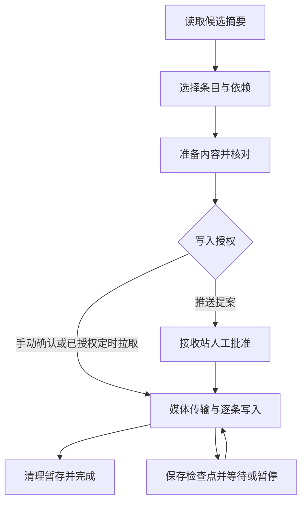

# 异地网站同步设计

## 模型与权限

两个网站各有独立数据库和媒体，借助HTTPS签名请求读取对端内容；接收站执行本地受权限约束的写入。共享密钥证明对端身份，不意味着允许对端直接写本站。

- 手动拉取：接收站创建预览，选择并确认后执行。
- 待批准推送：发送站提交提案，接收站人工重新核对/批准；后台调度不自动批准。
- 定时拉取：接收站保存模块、周期和增删授权，调度器使用受限服务授权分步执行。账号、角色或连接策略变化后需要重新核对授权。

仅在接收站开启定时拉取；切换主站前关闭原接收站策略，避免两端相互覆盖。同步的是所选业务模块与必要依赖，不是整库/系统配置的无条件镜像。

## 数据流和检查点

任务状态在 `sync_tasks` 保存，候选明细使用 `sync_task_items` 等配套表；不将整个正文作为状态面板返回值。`site_sync_work.step()`为关键步骤统一施加任务租约、开始/完成/错误检查点和重试门控。请求中断可能只留下开始标记，因此必须区分“已开始”与“已确认完成”。

每步准备一个记录或引用，增量执行时最多写一条业务记录。已完成写入保留，任务失败不保证整体事务回滚。继续使用原任务的检查点；重新开始创建新的预览，不自动继承旧选择和批准。

## 最新候选与删除边界

自动预览跨所选模块合并两端最新候选，按更新时间及稳定次序取最多500项。读取摘要、必要内容和依赖均分步进行；500限制针对候选，不是任意取前500条，也不是截断后把其余条目当作删除。

未入选旧条目保持不变，必要依赖另行准备并受总量/正文上限约束。删除候选需要对应身份及依赖检查；不删除本站独有媒体。同编号条目即使正文相同也可覆盖，不进行全文相同跳过。

## 资源参数

具体数值以 `backend/app/native/site_sync_limits.py` 为准。资源类型取服务端适配器，不能由浏览器任意切换。

| 参数 | 本地标准 | Worker低资源 |
| --- | --- | --- |
| 内容读取批量 | 5 | 1 |
| 版本读取批量 | 20 | 5 |
| 摘要读取批量 | 20 | 1 |
| 媒体优选分片 | 64KiB | 16KiB |
| 临时错误等待 | 5 / 15 / 60秒 | 60 / 180 / 600秒 |
| 单轮同步步骤 | 1 | 1 |
| 维护任务调度量 | 2 | 1 |

分片由两端协商并按文件固定；涉及Worker的新文件使用较小分片，旧文件任务可沿用原宽度，不可直接更改偏移计算。正文/任务仍有硬上限：单记录200000字节、任务最多2000条/4MiB正文、单媒体20MiB、媒体总量24MiB。不能据低批量推断所有数据库扫描、文件合并或冷启动都恒定低CPU。

## 重试、恢复与调度

有检查点的任务按连续无进展失败次数限额恢复：Worker最多重试30次，本地部署最多8次；每次观察到已持久化游标前进后重新计算额度，累计失败数保留。服务端拒绝早于等待截止的重复推进。权限、内容冲突、签名或校验失败立即暂停；无进展额度耗尽后人工检查再继续或取消。

`site_sync_schedule.tick()`读取授权和检查点推进有限工作。本地由`install_local()`接入应用生命周期；Worker通过 `deploy/cloudflare/runtime/sync_schedule.py` 与Cron执行，无需浏览器一直打开。等待期限到达只代表允许下一次推进，不代表已经执行。

同一任务通过租约避免浏览器与后台并行推进；涉及业务写入仍复核主体与策略。媒体分片、校验和清理沿用持久化进度，避免丢回执后盲目从头开始。

## 状态面板

后台“两站同步”页面使用 `site_sync_status.read(r, options=None)` 只读查询本站。参数 `active` 为布尔值，`after` 为上一页返回的时间/UID游标。一次最多取21条摘要判断下一页，显示20条；错误正文截取500字符。SQL投影有界不等于底层数据库只访问20条。

显示任务号、方向、父子关联、阶段、读写/媒体进度、创建/保存/失败时间、等待截止及错误；默认每60秒刷新，页面隐藏或操作忙碌时跳过，失败关闭自动刷新。查看不续跑，状态汇总只计算当前页。

“等待完成回执”是保存的开始标记，不是实时心跳；“回执逾期”不直接等于失败。未建立任务的推送提案在提案区显示，已清理历史不再列出。

## 关键函数

| 文件（backend/app/native/） | 入口 | 用法 |
| --- | --- | --- |
| site_sync_tasks.py | start(r, direction, scopes, …) | 创建预览；默认不写业务数据 |
| site_sync_tasks.py | advance(r, uid)、choose(r, uid, ids) | 推进预览、保存选择与依赖 |
| site_sync_preview.py | prepare(r, uid) | 从摘要选择建立准备子任务 |
| site_sync_apply.py | begin(r, uid, confirmation, approval=False) | 明确确认或审批后开始执行 |
| site_sync_apply.py | tick(r, uid, cancel=False) | 推进一个执行/清理步骤；取消并非回滚已提交条目 |
| site_sync_tasks.py | resume(r, uid)、restart(r, uid) | 继续原任务或建立新预览 |
| site_sync_proposals.py | send、review、reject、update_progress | 推送提案及接收端审批状态；均异步调用 |
| site_sync_schedule.py | save(r, data)、status(sql)、tick(base, …) | 策略保存、查看和后台推进 |
| site_sync_status.py | read(r, options=None) | 仅返回有界状态，不访问对端 |
| site_sync_history.py | prune(sql, uid=None, batch=…) | 有界历史清理，遵守活动/审批保护 |
| site_sync_transport.py | envelope、verify、binary_frame | 签名与二进制传输封装，不能用普通未签名请求替代 |

函数需由已认证的后台路由或保存的后台授权上下文调用。网站同步入口见 `site_sync_admin.install()`，前端交互见 `frontend/admin/static/js/native-site-sync.js`。相关调用参数和返回处理见 [函数索引](../FUNCTIONS.md)。

## Worker 超限与恢复边界

前端在有检查点的推进操作中识别数字或字符串错误码1101/1102，先读取保存状态，等待服务端恢复时间，再按有界次数重试。不会自动重放新建任务、批准或其他非推进操作；永久暂停状态仍要求人工处理。浏览器与后台均采用任务的进度恢复额度；Cron节奏保持不变。连续无进展仍会停止，不能将此行为理解为无条件无限重试。任务选择列表展示完整UID，可与任务监视表对应。

后台执行资格检查及推送审批回执检查使用轻量元数据查询；普通拉取也不再为了检查回执读取完整正文。身份权限、签名、分片摘要、版本及事务保护均保留。1102须结合 Cloudflare CPU/内存调用状态定位，网络传输字节数和页面显示的经过时间不能代表CPU或内存峰值。

## 进度检查点与状态计数

`site_sync_checkpoint.py` 定义本地检查点版本2（增加依赖核对与分析游标；旧检查点首次使用仅建立新基线）。数据库仅投影阶段、记录/依赖游标、媒体当前分片与合并游标、写入及清理位置；Python对该有界结果生成摘要。检查点不包含正文、凭据、错误文本、时间戳或人工选择。任务格式及对端签名协议保持兼容。

`site_sync_work.step()` 在持有任务租约时记录开始状态，并在返回或可捕获异常后核对已持久化游标。已提交后响应失败仍计有效进展；成功返回但游标不变不计进展。运行时被强制终止留下的running状态，在原恢复等待结束、下次取得租约时计一次未确认失败并核对位置。旧任务首次建立基线，不推算历史进展。

| work字段 | 含义 |
| --- | --- |
| checkpoint_version / checkpoint | 检查点格式及摘要，仅用于本地比较 |
| progress_events / last_progress_at | 观察到的持久化位置变化次数及观察时间；不等于记录数 |
| total_failures / uncertain_attempts | 累计失败及其中未确认完成的尝试次数 |
| stalled_attempts | 连续未观察到位置变化的已结束/未确认尝试次数；实际进展后清零 |
| completed_steps | 成功返回的请求数，不能据此认定数据前进 |

监控接口派生`recovery_state`：ready、no_progress、uncertain_wait、needs_reconciliation、retry_wait、retry_due、needs_attention、done、cancelled、expired。这些状态供观察使用，不授予重试权限；重试按进度恢复额度、冷却、租约和审批规则判断。手动继续不清空累计统计。

同步页所有时间使用同一显示时区：沿用后台时间编辑器保存的有效IANA时区，默认`Asia/Shanghai`（北京时间）；每个时间标明偏移及时区。UTC存储、定时比较和分页游标不改变。历史列表、监控、定时状态、提案与当前执行展示完整任务/提案ID，关联父任务、准备任务和执行任务分别标识。

## 高频媒体进度的局部读写

媒体下载、分组合并、摘要验证、发布和暂存清理使用`site_sync_patch.load()`投影：只将执行进度及当前一个媒体条目传入Python，不加载完整业务差异、所选ID清单或数据库准备数据。清理按`cleanup_index`取媒体，下载按`file_index`取媒体；取消后重新读取清理位置。候选最新500项与其必要依赖规则不变。

`site_sync_tasks.persist()`自动区分完整快照和局部快照；局部快照只以`json_set/json_remove`保存实际变化字段。所有任务状态写入维护本地`_sync_revision`修订令牌，局部写入在同一原子批次中检查令牌、任务状态与清理标记，旧请求不能覆盖新进度。审计和附带数据库操作随失败批次回滚。删除字段与写入JSON null分别处理，未加载的内容、媒体和准备数据保持原值。

完整准备、记录写入、版本校验和最终数据库提交仍按原流程读取所需任务数据。此优化减少Python解析/序列化、内存占用和数据库桥接传输；SQLite/D1仍须处理JSON列，不代表数据库物理写入已完全消除。权限、签名、分片/整文件摘要和租约保护保留；Cron节奏及对端协议不变，无需重置数据库。

## 按实际进展恢复

| 平台 | 连续无进展重试额度 | 等待阶梯 |
| --- | --- | --- |
| Worker | 30次 | 60、180、600秒，之后每次600秒 |
| Ubuntu、Windows等本地部署 | 8次 | 5、15、60秒，之后每次60秒 |

额度指初次失败后的恢复机会，额度用完后再次无进展失败则暂停。`retry_count`记录无进展失败，实际游标变化后清零；HTTP成功但无变化不清零。`total_failures`、`uncertain_attempts`继续累计，`stalled_attempts`仍记录所有未观察到变化的已结束/未确认尝试，与失败恢复次数含义不同。

运行时强制终止可能无法捕获1102；后台保留running标记，至少等待原300秒恢复窗口及租约保护，到期后比较已保存检查点。存在进展则补记进展并继续，没有进展则消耗恢复额度。多次无进展时恢复窗口可延长至600秒。不根据报错文本推断已提交内容，也不自动跳过失败条目。

浏览器重试读取一次保存状态后本地等待，不在冷却期轮询。后端已经永久暂停时立即停止；浏览器无法取得可靠任务状态时保留报错。后台使用同一任务的恢复截止时间和计数，避免叠加旧的三次限制；尚未建立检查点的建任务/连接失败沿用原有界等待策略。旧执行错误与未确认running状态并存时，后台允许进入检查点核对。

定时拉取仍须管理员预先启用并授权范围；按该授权推进已有定时流程，无需逐任务重新输入确认文字。待批准推送仍需接收方人工批准。暂停后手动继续重置本轮恢复次数，累计失败统计保留；取消不越过尚未结束的运行等待窗口。

## 后台续跑与任务衔接

管理员预先授权定时拉取后，后台自动衔接候选读取、依赖准备、确认执行和清理；关闭页面不取消后台策略。手动预览仍需确认，待批准推送仍需接收方批准。Worker需要启用Cron，本地部署需要服务保持运行；状态刷新和“查看”均为只读，不承担任务推进。

定时新任务与`service_meta`中的后台任务指向在同一事务保存。中断后不会因为任务指向尚未保存而重新建一份任务。接管已确认的手动执行任务时，先持久化对应ID，再由下一轮推进。准备子任务已创建但后台尚未切换时，沿父任务保存的`prepared_uid`衔接；重新开始的任务沿`restart_uid`衔接。

执行已结束但后台尚未记录完成时，下一轮补记终态及审批回执，再计算下一轮拉取间隔，不重新执行已完成内容。后台状态保存使用条件更新和原授权守卫，避免旧请求覆盖管理员修改或新恢复状态。进程中断留下的租约仍遵守原5分钟到期规则，不通过清空有效锁强行推进。

Worker入口依据任务本身的恢复截止时间判断冷却，不让已过时的后台重试时间挡住任务。监控区分后台自动推进、排队、人工确认、后台关闭及需要人工处理；显示当前、父、准备子任务与最近结束任务的完整ID。`next_attempt_at`是最早可恢复时间，实际推进取决于此后的调度轮次；`updated_at`表示最近后台状态记录，不是每次Cron调用的心跳。各视图时间统一使用后台显示时区。

## v0.15.165：按持久化进度判定异常

第一步完成：1101与1102都进入已有的有界恢复策略，包括对端HTTP 5xx响应中明确的Worker错误码。只检查有界错误摘要，不把普通HTTP 500或权限/签名错误泛化成可自动恢复错误。

每次异常后读取已提交检查点；读取、依赖准备、确认检查、媒体传输、业务提交、清理、推送提案回执和审批准备均纳入进度证据。批次宽度、时间戳、错误文字和手动选择不算业务进展。检查点版本升级为3；旧检查点首次建立新基线，不伪造历史进展。

- 有进展的异常：`last_outcome=progress_after_error`，连续无进展重试次数归零，仍保留冷却时间。
- 无进展的异常：`last_outcome=no_progress_error`，消耗连续无进展额度。
- 成功但无进展：不补充重试额度；权限/校验等永久错误即使出现进展仍暂停。
- `total_failures`保持兼容，含义为累计请求异常（包含未确认中断），界面不再称为累计任务失败。新增`failures_with_progress`、`no_progress_failures`分别记录有进展和无进展异常；历史数据不追溯拆分。
- `last_error_code/last_error_at`在后续成功后保留，用于诊断，不参与进度判断。

验证采用本地SQLite故障注入，不代表已在线验证Cloudflare CPU/内存限额。此版本只完成第一步，不新增手动任务独立授权或全阶段后台接管。下一步补全强制终止、回执不明时的延迟核对与恢复入口。

本步回归结果：97项Python测试和11项浏览器重试逻辑测试通过。覆盖1101/1102数字与字符串错误码、连续35次异常但持续推进、无进展耗尽额度、成功空转、事务回滚、永久错误、强制终止及后台任务衔接。

## v0.15.166：强制中断后的延迟核对

第二步完成。对启用了现有后台授权的任务，Worker Cron和本地调度遇到未确认的running记录时，先等待原恢复窗口（通常至少300秒）及有效锁结束，再单独执行一轮轻量检查点核对；这一轮不拉取业务数据、不合并媒体、不重复提交。

核对有实际进展时，重置连续无进展次数；没有进展时消耗原有额度。未完成任务保存为等待恢复，按平台冷却策略在后续调度轮次继续。已经done/cancelled的任务只补记运行终态，再由下一轮补记后台完成回执；不重做业务。核对结果先持久化，保存后回执再次丢失也不会重复累计同一次中断。

Worker轻量入口先检查任务锁和全局锁，锁尚有效时不初始化完整同步运行环境；写入运行状态必须由仍有效的任务锁保护，未成功写入不能报告保存成功。切换操作、手动继续和衔接子任务均不能绕过未结束的恢复窗口；手动继续先核对未确认记录，不直接抹去记录。

未确认任务不被历史清理删除；已写入业务终态但尚待核对的任务仍列在活动监控中。新增最近中断核对时间，与其他时间使用同一后台显示时区。读取监控本身不推进任务。

本步仍使用已有后台授权及Cron/本地服务入口。关闭后台策略的手动任务尚不会自动接管；第三步将补齐手动任务独立授权和各阶段后台续跑。测试为本地故障注入，未在真实Worker触发1101/1102进行线上验收。

第二步回归：128项Python测试与13项浏览器逻辑测试通过；另补充过期任务不得自动核对的边界测试，并复验核对、后台衔接和轻量入口。未修改数据库结构或对端签名协议。

## v0.15.167：手动任务独立后台续跑

第三步完成。新建手动预览默认登记本任务的读取授权；任务与授权在同一数据库事务保存。明确点击准备后，准备子任务也登记只读授权。读取/准备结束停止并等待人工确认，不从后台自动选择条目、确认写入或批准对端提案。

确认拉取、确认发送或接收方明确批准时，在耗时步骤开始前保存该任务的后续授权；授权绑定任务ID、对端修订、方向、模块、所选条目和审批请求ID，账号/角色凭据在每次后台提交时重新检查。完成后关闭本次授权，不创建新的同步轮次。更改选择范围需重新确认，普通恢复不能扩大旧授权。关闭定时策略不影响这些独立任务；Worker仍需Cron，本地仍需服务运行。退出登录不撤销已确认任务，但角色、密码或对端配置变化会使后台授权失效。

后台读取、确认复核、执行、媒体及清理继续使用已有检查点与1101/1102恢复机制。已保存的提案发送标识用于重试；检测到提案已送达后只查询回执，不重新创建提案。每次成功查询后至少等待60秒再查询；等待批准不自动消耗失败额度。回执查询只读取必要标识，不读取整份任务正文或媒体清单。

任务列表提供独立的暂停后台/恢复后台按钮；上方暂停也会暂停当前任务及已创建的准备子任务。定时策略不能越过手动任务的暂停。已开始的步骤可能完成，但后续受授权守卫阻止；取消仅清理剩余步骤，不回滚已提交内容。活动授权任务受到历史清理保护。

开始请求若在任务尚未持久化前失败，后台没有可接管的任务；需要再次发起。任务和授权已经保存而响应丢失时，可以从监控找到原任务并由后台继续。现有旧任务可在点击继续时登记本次授权。

此步未变更数据库结构、对端签名协议或最新500项的候选规则。第四步将继续优化低资源调度、批次/分片降速及多任务等待；当前每轮只推进有限工作，依赖现有平台恢复间隔。尚未在真实Cloudflare Worker上完成资源限额验收。

第三步验证：核心恢复、检查点、重试、历史与轻量入口回归121项通过，浏览器交互与重试逻辑51项通过；另通过双站点拉取、推送审批、准备子任务、响应丢失、授权撤销及取消清理的针对性集成验证。以上为本地测试和故障注入，未部署或进行真实Worker资源限额测试。

## v0.15.168：资源异常后降速与任务让行

第四步完成。Worker任务在捕获1101/1102，或核对未确认中断时，提高持久化资源降速档位，最多两档。档位与业务进度分开保存：降速本身不算进展；有实际进展的异常仍重置连续无进展计数。后续成功不会立即提速，避免反复触发资源限额。本地部署保持原批次策略。

| Worker任务状态 | 每次版本复核 | 新文件首选分片 | 成功后请求间隔 |
| --- | --- | --- | --- |
| 原低资源模式 | 最多5条 | 16 KiB | 1秒 |
| 降速1档 | 最多2条 | 8 KiB | 5秒 |
| 降速2档 | 最多1条 | 4 KiB | 15秒 |

正文和候选摘要仍每轮最多1条，清理每轮最多1个对象；异常后的60/180/600秒冷却策略不变。后台会保存成功步骤后的最早推进时间，浏览器遵循服务端返回的间隔；Cron与本地调度只在后续实际轮次推进，不通过请求内休眠等待。后台列表显示资源降速档位、实际文件分片和原有任务ID/时区。

媒体头新增支持分片大小列表，新宽度只在两端都支持时协商。旧版自适应对端仍使用16/64 KiB，旧固定协议保持64 KiB。每个文件的宽度在首次传输前保存，下载中途即使再遇到异常也不改变已保存宽度，以保持偏移、合并路径和清理检查点一致；后续新文件可使用更低档位。签名、版本和完整性验证不被跳过。

调度选择先排除冷却、成功后的降速等待、未确认恢复窗口和有效任务锁。就绪的独立手动任务按上次调度时间轮换；手动任务与可运行的定时任务交替获得一轮机会，一方暂不可运行时让另一方继续。轮换位置与调度结果同事务保存，不依赖页面或进程内存。全局执行锁仍串行保护业务写入，不允许多个任务同时覆盖同一站点。

本步不改变数据库结构、签名协议或最新500项规则。小分片会增加总请求及存储操作次数，以吞吐量换取更小的单次工作量。单条大记录、整体流式校验或发布等操作仍有不可再拆的部分；这不是对真实Worker资源限额的保证。下一步应集中做长时间、多阶段故障恢复验收，核对真实Worker的触发阶段和持续推进结果，再针对实际瓶颈优化。

第四步验证：分批回归与定向复验共覆盖177项Python用例、52项浏览器用例，全部通过。包含12项新增降速/调度专项，4 KiB媒体的丢失回执、合并、发布与清理，以及Worker/本地三种组合下的来源变更保护、网络冷却和提交不重放。跨平台旧用例中固定64 KiB及忽略冷却/人工恢复的假设已在v167复现后更新；保留提交日志只出现一次等业务断言。测试使用本地SQLite及D1/R2适配器替身，未部署或进行真实Worker限额验收。

## v0.15.169：连续故障恢复验收与错误状态隔离

第五步完成本地连续故障注入验收，并修复两项后台错误判定问题。测试通过推进等待时间模拟长时间任务，不在请求内睡眠，不重置业务游标或重试计数；不能将该结果视为真实Cloudflare CPU/内存限额验收。

| 场景 | 验收条件 |
| --- | --- |
| 三种组合：Worker→本地、本地→Worker、Worker→Worker | 使用签名HTTP接口及本地/D1/R2适配器替身完成拉取和推送，共6个端到端场景 |
| 拉取连续中断 | 保存进度后交替注入1101、1102和强制中断；读取及后续任务均超过30次累计异常仍完成，累计模拟等待超过1小时 |
| 多阶段完整性 | 读取、准备、媒体下载/合并/发布、逐条写入和清理均经过中断恢复；目标数据及文件一致，每个业务条目仅一次提交审计，暂存清理完毕 |
| 人工确认与退出登录 | 读取准备完成不写入业务；明确确认后退出登录，后台仍完成已授权任务 |
| 提案回执连续丢失 | 接收方已接受、发送方连续4次丢失响应；后续第5次送达请求保持同一提案ID，未创建重复提案 |
| 等待批准 | 连续查询待批准回执35次仍不写入；人工批准后接收方恢复执行，发送方最终取得同一提案的完成回执 |
| 无进展与权限边界 | 无进展超限停止任务及独立后台授权；权限失效停止授权，旧工作记录保留；新回执异常使用自己的冷却与额度 |

修复一：旧任务的可重试错误或running状态，不再掩盖新发生的授权失效、范围变化或回执错误。调度候选只额外读取尝试序号与失败时间两个小字段；仅本轮新产生、错误码匹配的任务失败沿用任务冷却时间。没有新任务失败记录的回执错误单独退避，避免反复使用过期时间形成忙循环。

修复二：本轮任务已经因连续无进展或永久错误停止恢复时，同步关闭该任务的后台授权，不再用另一套授权重试额度重新标为可运行。保存的业务进度、人工恢复入口及取消清理保持原规则；有实际进展的异常仍重置连续无进展次数。

复现专项：`python -m pytest -q tests/test_sync_endurance_v169.py tests/test_sync_grant_errors_v169.py`。测试替身覆盖事务、签名、对象版本与流式操作接口；不模拟真实Worker隔离实例内存、CPU配额或Cron到达延迟。实机部署后应观察完整任务ID、最近有效进展、累计异常、连续无进展、降速档位及最早恢复时间，确认页面关闭后Cron仍持续推进。

此版不改变数据库结构、对端签名协议、人工批准要求和最新500项候选规则。尚未部署或触发真实Worker限额测试。

第五步结果：分批回归与定向复验覆盖105项选定Python测试，全部通过；其中6项为跨平台连续故障端到端验收，8项为新旧错误隔离及任务/授权停止边界专项。未修改浏览器交互代码，本步未重复上一版的浏览器测试。

## v0.15.170：独立回执核对与持续后台恢复

本版替代 v169 的“连续无进展超限停止”规则：任务没有72小时或其他总时长限制。1101、1102及既有可恢复网络错误，只要持久化游标有进展，就重置连续无进展计数；只有时间戳、HTTP成功或调度到达不算进展。连续无进展超过原阈值后，Worker每小时、本地每15分钟尝试一次，后台授权不会因此关闭。权限失效、签名错误和数据冲突仍需人工处理。

回执的5分钟窗口保留为“最早可核对时间”，不代表整个任务超时。Worker Cron和本地后台循环先进入独立调度器：保存到达记录、选择已授权任务、核对逾期回执，然后才按需要初始化完整同步资源。核对只读取精简检查点并更新工作回执，不会重放网络请求、写入业务内容或批准提案。更新语句同时检查管理员和角色版本、模块权限、对端版本、手动授权绑定、旧工作记录、检查点及有效执行锁；并发更新会使本次核对放弃提交。

每个任务另有持久化调度记录，包括启动阶段、结束时间、错误类型和下次允许时间。普通初始化/核对异常按1、2、4分钟逐步退避，最多每小时尝试；强制终止留下未完成记录，等待窗口后允许恢复。退避任务让出其他任务的调度机会。更换授权后可以解除授权错误造成的暂停，旧调度轮次不能覆盖新记录。删除任务历史时一起删除其调度记录。

监控页同时显示任务回执与调度回执，显示最近后台调度到达时间，避免把授权存在误当作后台正常工作。刷新仍然只读。浏览器达到自身重试上限后停止前台循环；已授权后台任务继续按保存的进度低频恢复。尚未升级运行过后台调度时，页面会明确显示“尚无后台调度到达记录”。

部署不需要数据库迁移，继续使用现有 `service_meta` 和工作记录；对端协议和人工确认要求保持兼容。升级后，现有已授权、回执逾期的任务可在下一次符合条件的调度中核对。Cron未配置、未到达或数据库完全不可用时，程序无法自行创造调度执行机会；需要结合新监控记录和平台日志定位。代码及适配器测试不代表已经部署到真实Worker或复现真实配额限制。

## v0.15.171：初始化链路梳理与阶段记录（第一步）

增加后台初始化与执行阶段的持久化时间线。Worker 分别记录通用资源模块加载、同步业务模块加载、资源对象创建、调度选择、授权与上下文、执行锁、业务步骤、调度结果保存；轻量回执核对仍先于完整资源初始化。监控中的“阶段定位”可展开查看开始时间、结束时间、墙钟耗时、模块导入前是否已加载和上一轮最后阶段。强制终止时保留阶段开始标记，不虚构阶段耗时，也不将“缺少完成记录”解释为进程仍然存活。

本步不拆分或精简资源工厂，不改变分批大小、同步协议、权限检查、人工批准、重试间隔及业务进度判定。诊断更新不算任务进展；诊断写入失败进入独立调度退避，不关闭手动授权。记录使用原调度回执的条件更新，旧调度不能覆盖新记录。详细依赖清单、计时边界、诊断开销与第二步范围见 [初始化链路说明](sync-initialization-v171.md)。

## v0.15.172：最新候选读取专用初始化（第二步）

Worker 对已经存在、仍在读取最新候选的任务，先通过小型 SQL 投影判断是否适合专用路径。符合条件时直接复用当前数据库连接，只创建平台标识、后台授权与当前权限上下文，不调用通用资源工厂，不创建模板、媒体/缓存存储、学术查询、翻译等资源对象。手动只读续跑与定时拉取均支持；新建任务、普通预览、准备、媒体传输、实际写入和审批继续使用完整路径。

原有 latest 分页算法、最新500项规则、对端签名校验、任务ID、游标与断点格式保持不变；回执逾期仍先按170/171规则核对。每次检查点与候选写入的事务额外复核当前授权、模块权限、对端版本及任务范围，避免读取过程中被暂停后提交。读取完成或阶段已变化时，下一轮重新选择完整路径，不会由只读上下文尝试执行写入或审批。

初始化时间线新增“检查候选读取专用路径”“加载候选读取组件”“创建候选读取最小上下文”。完整范围、验证和修改清单见 [专用路径说明](sync-latest-runtime-v172.md)。

## v0.15.173：媒体和内容执行按需初始化（第三步）

Worker 后台执行改用同步专用资源，复用已打开的 SQL；后台授权、租约、事务检查点和恢复机制不变。媒体与缓存 R2Store 在实际访问时才创建，并沿用原绑定和前缀验证。普通内容步骤不再初始化网站渲染、密码、元数据及翻译客户端。共享审计函数保持原写入内容及事务边界。详细范围见 [第三步说明](sync-execution-runtime-v173.md)，三步完整改动清单见 [文件路径汇总](sync-initialization-three-steps.md)。

## v0.15.174：轻量 HTTP、独立 Cron 诊断与更细准备步骤

状态查询与同步 JSON API 从完整网站应用中分离；最外层媒体绑定也按需解析。Cron 提前记录入口日志并保存独立心跳，页面显示部署版本与缺失阶段记录。目标读取、字段规范化和引用提取分别保存；Worker 默认版本批次为1条、新协商媒体分块为4 KiB。浏览器状态查询失败后退避重试，页面打开时可限频辅助唤醒已有授权任务。关闭页面后仍依赖 Cron，不能保证平台强制终止时运行异常清理。详见 [174 说明](sync-recovery-v174.md)。

## v0.15.175：最小 Cron 启动路径

移除 Cron 顶层的网站、模板、快传及字段定义依赖；数据库连接后先保存独立心跳，再加载维护调度。同步 Cron 将恢复预检查和实际业务拆成不同轮次，每轮重新核对授权及租约，预检查不算业务进展。页面区分等待下一轮业务推进。无需数据库迁移，分钟频率及原维护时隙保持不变。详见 [第一步说明](sync-minimal-cron-v175.md) 和 [改动文件清单](sync-v175-files.md)。

## v0.15.176：长字段分片协议

按需准备新增能力协商、字段清单和带版本/摘要的分片读取。Worker 默认每轮最多 512 个 JSON 字符，可降至 256/128；分片暂存与游标原子提交，回执丢失后续读。来源变更时阻止发布不完整记录，完成后再衔接既有审批及执行。旧对端兼容原协议；两端升级才能使用分片。单条 200KB 上限及后续整条规范化仍保留。详见 [第二步说明](sync-long-fields-v176.md) 与 [文件清单](sync-v176-files.md)。

## v0.15.177：媒体合并与校验恢复边界

合并前保存输入版本及意图；已有输出逐段比对后复用。完整 SHA-256 改为保存计算状态的分段校验，Worker 默认每轮4KiB，可降至1KiB/256字节。发布回执丢失后核对目标，归属不明时取消不误删。状态列表显示媒体子步骤与校验字节进度。原生合并/复制仍为单次存储操作，不等于全程 multipart。详见 [第三步说明](sync-media-recovery-v177.md) 和 [改动文件清单](sync-v177-files.md)。

## v0.15.178：三小时恢复巡检

保留分钟 Cron，新增 `0 */3 * * *` 三小时事件，按 controller.cron 进入单独恢复分支，不占用整点快传清理路径。每轮最多核对、预检查或推进一个步骤，继续遵守原授权、冷却及租约。巡检有独立心跳与页面提示，不能掩盖分钟 Cron 未到达。两事件仍共用 Worker 入口，不能视为独立容灾。详见 [第四步说明](sync-watchdog-v178.md) 与 [改动文件清单](sync-v178-files.md)。

## v0.15.179：免费方案与三小时巡检

使用单条五分钟 Cron，每天约288次定时调用；三小时巡检保留在入口内部，错过整点则下一轮补做，不额外占触发器名额。页面等待阈值调整为15分钟。同步会变慢，巡检依赖同一 Cron 的事件到达。详见 [设计说明](sync-cron-quota-v179.md) 和 [文件清单](sync-v179-files.md)。

## v0.15.180：网页访问优先

恢复前后台纯定义的部署预加载，避免首次网页请求集中导入；应用及请求状态仍在运行时创建。同步继续按五分钟Cron分轮执行，保留内部三小时巡检及断点恢复。详见 [预加载修复说明](sync-http-preload-v180.md)。

## v0.15.181：预构建网页路由

在无运行时副作用的部署阶段构建前后台路由及中间件，普通网页复用应用；身份和存储仍按请求解析。同步保持后台分轮执行，快传会话仍独立创建。详见 [第二步说明](web-snapshot-v181.md)。
